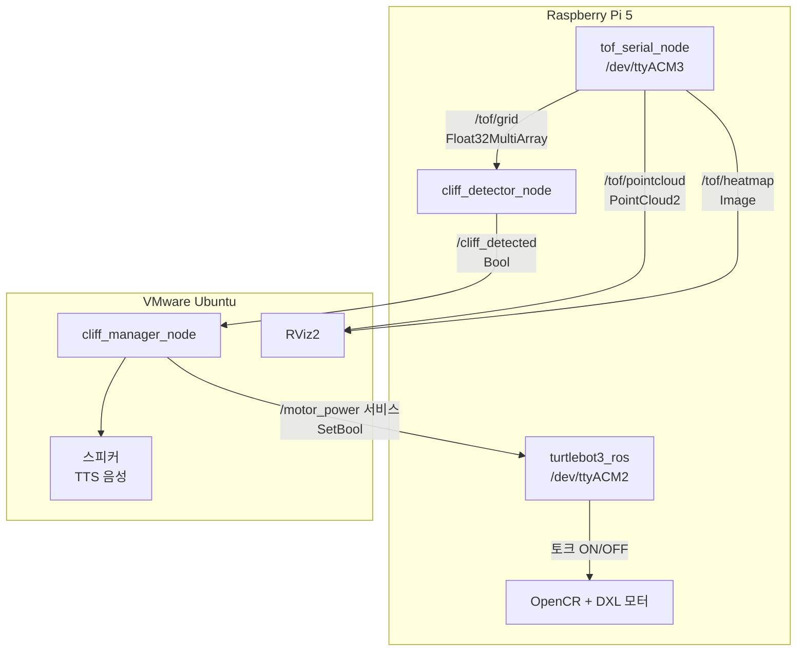
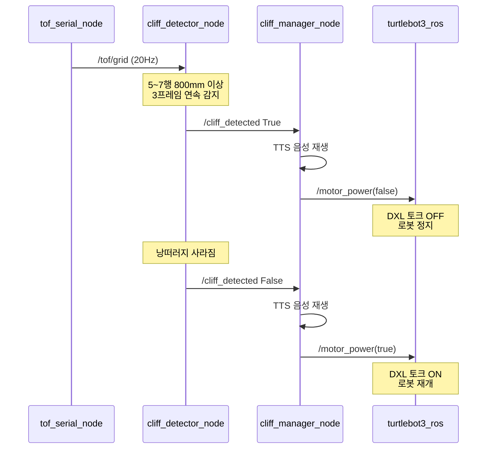

# 동영상 링크
```
https://youtu.be/aUYkpayOvhc
```

# TurtleBot3 워크스페이스

Raspberry Pi 5 + ROS2 Jazzy 기반 TurtleBot3 Burger 운용 워크스페이스.
VL53L8CX ToF 센서를 이용한 낭떠러지 자동 감지, 음성 안내, DXL 자동 정지 시스템.

---

## 시스템 구성도



---

## 토픽 / 서비스 정리

| 이름 | 타입 | 방향 | 역할 |
|------|------|------|------|
| `/tof/grid` | `Float32MultiArray` | Pi 내부 | 64개 거리값(mm), OOR=-1.0 |
| `/tof/pointcloud` | `PointCloud2` | Pi → VMware | 3D 포인트클라우드 시각화 |
| `/tof/heatmap` | `Image` | Pi → VMware | 480×480 히트맵 시각화 |
| `/cliff_detected` | `Bool` | Pi → VMware | True=낭떠러지 감지, False=해제 |
| `/motor_power` | `SetBool` (서비스) | VMware → Pi | True=토크 ON, False=토크 OFF |

---

## 포트 구성

| 포트 | 장치 | 담당 노드 |
|------|------|-----------|
| `/dev/ttyACM2` | OpenCR | `turtlebot3_ros` |
| `/dev/ttyACM3` | Raspberry Pi Pico 2 (VL53L8CX) | `tof_serial_node` |

---

## Raspberry Pi 실행 명령

### 터미널 1 — 로봇 메인 노드

```bash
export TURTLEBOT3_MODEL=burger
export LDS_MODEL=LDS-03
RMW_IMPLEMENTATION=rmw_fastrtps_cpp ROS_DOMAIN_ID=30 \
  ros2 launch turtlebot3_bringup robot.launch.py usb_port:=/dev/ttyACM2
```

**역할:**
- OpenCR(`/dev/ttyACM2`)과 통신
- 시작 시 DXL 토크 자동 활성화
- 5초간 IMU 자이로 캘리브레이션
- `/motor_power` 서비스 제공 → DXL 토크 ON/OFF

---

### 터미널 2 — ToF 센서 드라이버

```bash
ros2 run vl53l8cx_ros2 tof_serial_node --ros-args -p port:=/dev/ttyACM3
```

**역할:**
- Pico 2(`/dev/ttyACM3`)에서 VL53L8CX 8×8 거리 데이터 읽기
- 20Hz 주기로 3가지 토픽 발행:
  - `/tof/grid` — 낭떠러지 감지 노드용
  - `/tof/pointcloud` — RViz2 3D 시각화용
  - `/tof/heatmap` — RViz2 이미지 시각화용

---

### 터미널 3 — 낭떠러지 감지 노드

```bash
ros2 run vl53l8cx_ros2 cliff_detector_node
```

**역할:**
- `/tof/grid` 구독 → 5~7행(하단) 거리값 분석
- 800mm 이상 픽셀이 4개 이상, 3프레임 연속 감지 시:
  - `/cliff_detected True` 발행
- 낭떠러지 사라지면:
  - `/cliff_detected False` 발행

---

## VMware Ubuntu 실행 명령

### 사전 준비 (최초 1회)

```bash
# ROS_DOMAIN_ID Pi와 동일하게 설정
echo "export ROS_DOMAIN_ID=30" >> ~/.bashrc
source ~/.bashrc

# 패키지 복사 및 빌드
mkdir -p ~/ros2_ws/src
scp -r chan@<Pi_IP>:~/turtlebot3_ws/src/cliff_manager ~/ros2_ws/src/
pip install gtts pygame
cd ~/ros2_ws
colcon build --packages-select cliff_manager
source install/setup.bash
```

---

### 터미널 1 — 낭떠러지 대응 노드

```bash
ros2 run cliff_manager cliff_manager_node
```

**역할:**
- `/cliff_detected` 구독
- `True` 수신 시:
  1. "낭떠러지가 감지되어서 우회하겠습니다" 음성 재생
  2. `/motor_power(false)` 서비스 호출 → DXL 토크 OFF → 로봇 즉시 정지
- `False` 수신 시:
  1. "낭떠러지가 해제되었습니다" 음성 재생
  2. `/motor_power(true)` 서비스 호출 → DXL 토크 ON

---

### 터미널 2 — RViz2 시각화

```bash
rviz2
```

**설정:**
- Fixed Frame: `tof_sensor`
- PointCloud2 추가 → 토픽: `/tof/pointcloud` → QoS: Best Effort
- Image 추가 → 토픽: `/tof/heatmap` → QoS: Best Effort

---

## 낭떠러지 감지 동작 흐름



---

## 트러블슈팅

### turtlebot3_ros — `opencr.id` 에러
파라미터 파일 없이 `ros2 run`으로 직접 실행한 경우. launch 파일로 실행:
```bash
ros2 launch turtlebot3_bringup robot.launch.py usb_port:=/dev/ttyACM2
```

### turtlebot3_ros — `Failed connection with Devices`
포트 번호 확인:
```bash
udevadm info /dev/ttyACM2 | grep ID_MODEL
udevadm info /dev/ttyACM3 | grep ID_MODEL
```
OpenCR 포트에 `usb_port:=` 옵션으로 지정.

### RViz2에서 토픽 데이터 안 나옴
각 디스플레이의 QoS → Reliability를 **Best Effort**로 변경.

### VMware에서 Pi 토픽이 안 보임
VMware 네트워크 모드 **Bridged** 확인. Pi와 `ROS_DOMAIN_ID=30` 동일 여부 확인.


